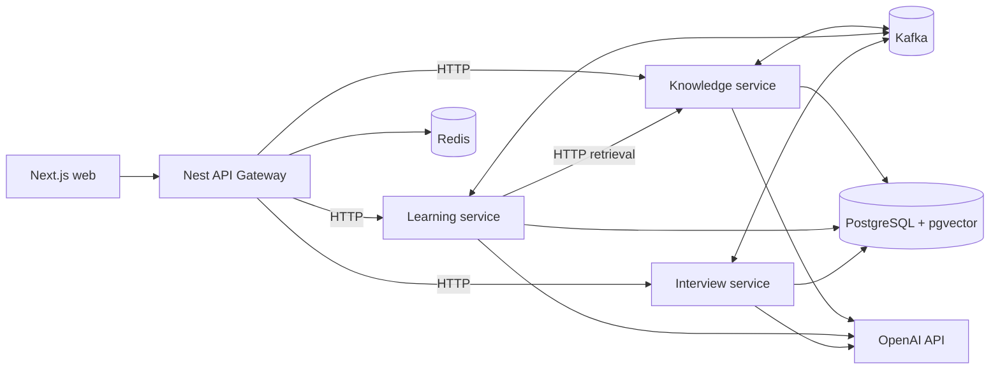

# wellllAI

MVP-платформа для двух сценариев:

- обучение по PDF или выбранной теме;
- подготовка к собеседованиям с персональной обратной связью.

Frontend построен на Next.js, публичный API — на NestJS. Предметные области разнесены по NestJS-микросервисам, долгие процессы и доменные события проходят через Kafka. PostgreSQL является постоянным хранилищем, `pgvector` используется для RAG, Redis — для rate limit и краткоживущего состояния.

## Архитектура



Kafka не используется для передачи PDF и не заменяет синхронный HTTP. Через Kafka идут долгие команды, статусы и доменные факты; пользовательские запросы, которым нужен быстрый ответ, проходят по HTTP.

## Структура

```text
apps/
  web/                 Next.js App Router
  api-gateway/         публичный REST API и rate limit
  knowledge-service/   PDF, темы, chunks, embeddings, pgvector
  learning-service/    программы, Q&A, тесты, attempts, mastery
  interview-service/   сценарии, сессии, ходы и оценки

packages/
  contracts/           runtime-схемы и версионированные Kafka-сообщения
  platform/            PostgreSQL, Kafka, outbox/inbox и Redis primitives
```

Каждый сервис организован через порты и адаптеры. Доменная/application-логика не зависит от OpenAI, Kafka или конкретного способа хранения данных.

## Важные решения

- Один PostgreSQL-кластер допустим для MVP, но каждый сервис владеет собственной схемой.
- Межсервисные `JOIN` и внешние ключи между схемами запрещены.
- Отдельного «универсального AI-service» нет: промпты и схемы ответа принадлежат доменам,
  а OpenAI подключён через заменяемые порты. Так learning и interview не сцепляются общей
  god-службой.
- События создаются через transactional outbox.
- Consumers обязаны быть идемпотентными через inbox или естественный уникальный ключ.
- Ответ на вопрос интервью содержит стабильный клиентский `answerId` и ожидаемый номер вопроса:
  сетевой повтор не создаёт второй ход и не сдвигает сценарий.
- Kafka partition key — идентификатор агрегата: `sourceId`, `programId` или `sessionId`.
- OpenAI Structured Outputs дополнительно проверяются локальными Zod-схемами.
- Ссылки модели на chunks проверяются сервером; неизвестные или неточные цитаты отбрасываются.
- Сгенерированный по теме материал хранится как неизменяемая версия знаний.

## Публичный API MVP

Базовый путь: `/api/v1`. Ответы имеют форму `{ data, meta, error }`.

```text
POST /learning-programs/from-topic
POST /learning-programs/from-document
GET  /learning-programs/:programId
GET  /learning-programs/:programId/progress
POST /learning-programs/:programId/questions
POST /learning-programs/:programId/quizzes
POST /questions/:questionId/attempts

POST /interview-programs
GET  /interview-programs/:sessionId
POST /interview-programs/:sessionId/answers
```

До добавления JWT gateway принимает `x-user-id`. Если заголовка нет, используется один фиксированный demo-user. Это осознанное ограничение MVP, а не production-аутентификация.

## Что намеренно отложено

- Docker Compose и запуск всей инфраструктуры;
- CI/CD;
- production-аутентификация;
- object storage для больших PDF;
- OCR сканов;
- WebSocket/SSE;
- карточки и автоматическая сборка следующего урока после накопления статистики;
- ветвление интервью по предыдущим ответам (в MVP сценарий фиксируется на старте);
- биллинг и лимиты OpenAI по тарифам.

Конфигурационный контракт перечислен в `.env.example`; реальных ключей в репозитории быть не должно.
