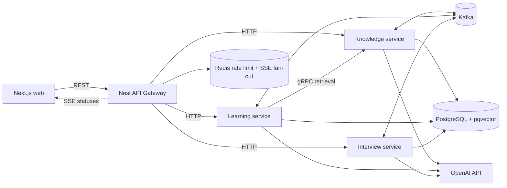

# wellllAI

MVP-платформа для двух сценариев:

- обучение по PDF или выбранной теме;
- подготовка к собеседованиям с персональной обратной связью.

Frontend построен на Next.js, публичный API — на NestJS. Предметные области разнесены по NestJS-микросервисам, долгие процессы и доменные события проходят через Kafka. PostgreSQL является постоянным хранилищем, `pgvector` используется для RAG, Redis — для rate limit и краткоживущего состояния.

## Dev-запуск через Docker

Нужны Docker Desktop и Docker Compose 2.22 или новее. Локальная установка Node.js, PostgreSQL, Kafka и Redis для этого режима не требуется.

```powershell
Copy-Item .env.example .env
# Укажите настоящий OPENAI_API_KEY в .env, если нужны рабочие AI-сценарии.
docker compose up --build --watch
```

Если Node.js уже установлен, короткий эквивалент команды запуска — `npm run docker:dev`.

Команда собирает dev-образ и поднимает PostgreSQL с `pgvector`, Kafka в KRaft-режиме, Redis, миграции, четыре backend-приложения и Next.js. Значение `OPENAI_API_KEY=replace-me` не мешает контейнерам запуститься, но запросы к модели завершатся ошибкой авторизации.

После запуска доступны:

- frontend — `http://localhost:3000`;
- API Gateway — `http://localhost:3001`, health check — `http://localhost:3001/api/health`;
- PostgreSQL, Kafka и Redis с хоста — порты `15432`, `29092` и `16379` (переопределяются через `.env`);
- внутренние backend-порты `3011`, `3012`, `3013` и gRPC `4011` доступны только в Compose-сети, чтобы не конфликтовать с локальными процессами.

`docker:dev` включает Compose Watch. Изменения в `apps/*/src`, web `app/components/lib`, `packages/contracts`, `packages/platform` и gRPC `.proto` синхронизируются автоматически. NestJS-сервисы проходят инкрементальную TypeScript-сборку и перезапускаются только после успешной компиляции; Next.js использует Fast Refresh. Изменение `package.json` или `package-lock.json` вызывает пересборку соответствующего dev-образа.

Новые SQL-миграции добавляйте новым файлом в `apps/<service>/migrations`; применить их к уже запущенному стеку можно так:

```powershell
docker compose build db-migrate
docker compose run --rm db-migrate
```

Остановить стек без удаления данных:

```powershell
npm run docker:down
```

Полный сброс удаляет PostgreSQL и Kafka volumes вместе со всеми локальными данными:

```powershell
npm run docker:reset
```

## Архитектура



Kafka не используется для передачи PDF и не заменяет синхронные вызовы. Через Kafka идут долгие команды, статусы и доменные факты; публичные пользовательские запросы проходят по HTTP, а синхронный retrieval между learning и knowledge — по gRPC. Изменения фоновых статусов доставляются браузеру через SSE.

## Структура

```text
apps/
  web/                 Next.js App Router
  api-gateway/         публичный REST API и rate limit
  knowledge-service/   PDF, темы, chunks, embeddings, pgvector
  learning-service/    программы, Q&A, тесты, attempts, mastery
  interview-service/   сценарии, сессии, ходы и оценки

packages/
  contracts/           runtime-схемы и версионированные Kafka-сообщения
  platform/            PostgreSQL, Kafka, outbox/inbox и Redis primitives
```

Каждый сервис организован через порты и адаптеры. Доменная/application-логика не зависит от OpenAI, Kafka или конкретного способа хранения данных.

## Важные решения

- Один PostgreSQL-кластер допустим для MVP, но каждый сервис владеет собственной схемой.
- Межсервисные `JOIN` и внешние ключи между схемами запрещены.
- Отдельного «универсального AI-service» нет: промпты и схемы ответа принадлежат доменам,
  а OpenAI подключён через заменяемые порты. Так learning и interview не сцепляются общей
  god-службой.
- События создаются через transactional outbox.
- Consumers обязаны быть идемпотентными через inbox или естественный уникальный ключ.
- Ответ на вопрос интервью содержит стабильный клиентский `answerId` и ожидаемый номер вопроса:
  сетевой повтор не создаёт второй ход и не сдвигает сценарий.
- Kafka partition key — идентификатор агрегата: `sourceId`, `programId` или `sessionId`.
- OpenAI Structured Outputs дополнительно проверяются локальными Zod-схемами.
- Ссылки модели на chunks проверяются сервером; неизвестные или неточные цитаты отбрасываются.
- Сгенерированный по теме материал хранится как неизменяемая версия знаний.

## Публичный API MVP

Базовый путь: `/api/v1`. Ответы имеют форму `{ data, meta, error }`.

```text
POST /learning-programs/from-topic
POST /learning-programs/from-document
GET  /learning-programs/:programId
GET  /learning-programs/:programId/progress
POST /learning-programs/:programId/questions
POST /learning-programs/:programId/quizzes
POST /questions/:questionId/attempts

GET  /learning-programs/:programId/events  (SSE)

POST /interview-programs
GET  /interview-programs/:sessionId
POST /interview-programs/:sessionId/answers
GET  /interview-programs/:sessionId/events (SSE)
```

До добавления JWT gateway принимает `x-user-id`. Если заголовка нет, используется один фиксированный demo-user. Это осознанное ограничение MVP, а не production-аутентификация.

## Что намеренно отложено

- production Docker-образы и orchestration;
- CI/CD;
- production-аутентификация;
- object storage для больших PDF;
- OCR сканов;
- WebSocket для двусторонних realtime-сценариев;
- карточки и автоматическая сборка следующего урока после накопления статистики;
- ветвление интервью по предыдущим ответам (в MVP сценарий фиксируется на старте);
- биллинг и лимиты OpenAI по тарифам.

Конфигурационный контракт перечислен в `.env.example`; реальных ключей в репозитории быть не должно.
